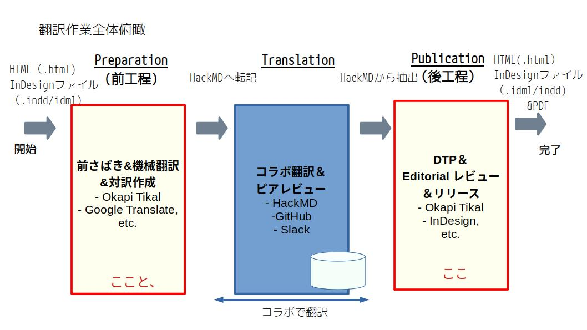

# Translation "2023 The state of OSPO (by LF Research) "

This is Japanese translation of OSPO Report "[The 2023 State of OSPOs and OSS Initiatives](https://www.linuxfoundation.org/research/ospo-2023)" by LF Research. Note that the original paper is translated **collaboratively** . 

Note:  Pdf file in this repository may not be "published version". But anyway the translation here will be reviewed by LF Japan and released.

## Document volume
- 47-page slide
- 12,658 words 

## Supported by:
The Linux Foundation Japan

## Chapters to be translated 
1. Cover and index: 33 lines,161 words,
2. INFOGRAPHIC:   
3. ABOUT THIS STUDY: 10 lines, 590 words
4. INTRODUCTION: 6 lines, 375 words
5. KEY FINDINGS: 22 lines, 1449 words
6. THE CURRENT STATE OF OSPOS AND OSS INITIATIVES: 45 lines, 2459 words　
7. THE BENEFITS AND CHALLENGES OF AN OSPO OR AN OSS INITIATIVE : 17 lines, 832 words
8. OSPO AND OSS INITIATIVE SUSTAINABILITY: 16 lines 868 words
9. PERSPECTIVES OF ORGANIZATIONS PLANNING TO IMPLEMENT AN OSPO OR AN OSS INITIATIVE: 12 lines, 669 words
10. HOW OSPOS AND OSS INITIATIVES INFLUENCE LICENSE COMPLIANCE AND SECURITY： 12 lines, 613 words
11. CONCLUSION, METHODOLOGY: 18 lines, 713words
12. ACKNOWLEDGMENTS,ABOUT THE AUTHORS: 317 lines, 3727 words 
13. Boilerplate: 11 lines 178 words

## About the LFJ Collaborative Translation Effort (CTE) 

***"How translation works can be more effective, efficient and ENJOYABLE in COLLABORATIVE manner? "***
This is a big challenge about translation, and is also a notion that **native authors don't care**. Our effortrs focus on this. And this output here is also a a case study of such such efforts, based on a process like below. 

